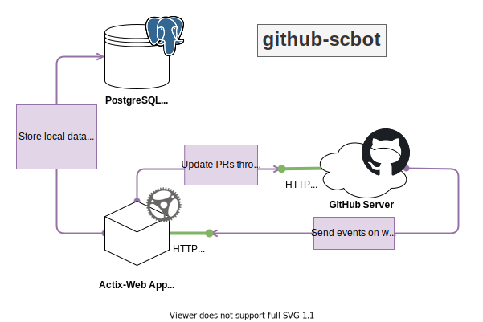

# GitHub SC Bot

Experimental GitHub Bot to manage SharingCloud development workflows.  
Uses **PostgreSQL** and **Redis**.

[CHANGELOG](./CHANGELOG.md)

## Why ?

GitHub is great and contains many useful features, but sometimes you need more.
Today, you can use labels to have a quick view on the steps of your workflow,
but you have to put them by hand, or write scripts to manipulate them.

One GitHub-hosted possibility is to use GitHub Actions as a workflow orchestrator
(listening on pull request updates, added comments, or even check runs), but GitHub Actions _are_ checks,
so they need to boot at each GitHub event you want to support. They will also show on your Actions list,
so your actual actions (as tests or builds) are not easily visible anymore.

Another problem with GA is that you need to duplicate your workflows for each of your repositories, even if you can use packages
(as on GitHub Packages).

So here is another idea, why not use a centralized bot, which can react to webhook events to manage your workflows, can handle multiple repositories at once,
maintaining state in a database and using per-repository configuration files ? Using the workflow events and GitHub API you can have almost real-time interactions.

Some bots like this already exists, like the Bors bot for the Rust programming language, but this bot will be more specifically designed for our own use-cases.
Il will add some features:

- Use a command system through issue comments to drive the bot
- Specify a regular expression to be matched for pull request titles
- Specify manual QA status for a pull request (skipped, fail, pass, waiting)
- Specify required reviewers for a particular pull request, and lock the merge if these reviews do not pass
- Apply specific labels on pull requests depending on their current state
- Maintain an automatically updated status comment with relevant details
- And maintain a commit status to prevent or allow merge

It will also be drivable via a command-line interface (for one-time actions as synchronizing state, or
import/export), and if possible a terminal-like user interface (TUI, à la htop).

## Features

- [x] Manage PR lifecycle with local data stored in a PostgreSQL database
- [x] Reacts to GitHub Webhooks to update review status
- [x] Generate a summary comment (once per PR)
- [x] Validate PR titles depending on per-repository regexes
- [x] Reacts to comments: Set QA status (or skip), ping, lock/unlock, merge, etc.
- [x] Require mandatory reviewers
- [x] Merge support with merge rules depending on head and base branches (specific merge strategies)
- [x] Enable auto-merge
- [x] Actions that can be triggered from external sources, with simple token-based authentication
- [x] Give rights to external sources on specific repositories
- [x] Send GIFs!
- [ ] Terminal UI interface to manage pull request status

## Infrastructure schema

## Step labels

Process can be followed with labels, which are auto applied depending on the current pull request state, in this order:

- PR is WIP? **step/wip**
- PR title is not valid? **step/awaiting-changes**
- Waiting for checks? **step/awaiting-checks**
- Checks failed? **step/awaiting-changes**
- Waiting for required reviews? **step/awaiting-required-review**
- Waiting for reviews? **step/awaiting-reviews**
- Waiting for QA? **step/awaiting-qa**
- QA failed? **step/awaiting-changes**
- PR is locked? **step/locked**
- All good? **step/awaiting-merge**

## Available message commands

This README supposes the default bot handle: 'bot'.

- `bot noqa+`: _Skip QA validation_
- `bot noqa-`: _Enable QA validation_
- `bot qa+`: _Mark QA as passed_
- `bot qa-`: _Mark QA as failed_
- `bot qa?`: _Mark QA as waiting_
- `bot nochecks+`: _Skip checks validation_
- `bot nochecks-`: _Enable checks validation_
- `bot automerge+`: _Enable auto-merge for this PR (once all checks pass)_
- `bot automerge-`: _Disable auto-merge for this PR_
- `bot lock+ <reason?>`: _Lock a pull-request (block merge)_
- `bot lock- <reason?>`: _Unlock a pull-request (unblock merge)_
- `bot req+ <reviewers>`: _Assign required reviewers (you can assign multiple reviewers)_
- `bot req- <reviewers>`: _Unassign required reviewers (you can unassign multiple reviewers)_
- `bot strategy+ <strategy>`: _Override merge strategy for this pull request_
- `bot strategy-`: _Remove the overriden merge strategy for this pull request_
- `bot merge <merge|squash|rebase?>`: _Try merging the pull request with optional strategy_
- `bot ping`: _Ping me_
- `bot gif <search>`: _Post a random GIF with a tag_
- `bot is-admin`: _Check if you are admin_
- `bot help`: _Show this comment_

## Available admin message commands

If you have admin rights (you can set with `auth add-admin-rights <username>`), you have access to the following commands:

- `bot admin-help`: _Show this comment_
- `bot admin-enable`: _Enable me on a pull request with manual interaction_
- `bot admin-disable`: _Disable me on a pull request with manual interaction_
- `bot admin-set-default-needed-reviewers <count>`: _Set default needed reviewers count for this repository_
- `bot admin-set-default-merge-strategy <merge|squash|rebase>`: _Set default merge strategy for this repository_
- `bot admin-set-default-pr-title-regex <regex?>`: _Set default PR title validation regex for this repository_
- `bot admin-set-default-automerge+`: _Set automerge enabled for this repository_
- `bot admin-set-default-automerge-`: _Set automerge disabled for this repository_
- `bot admin-set-default-qa-status+`: _Enable QA validation by default for this repository_
- `bot admin-set-default-qa-status-`: _Disable QA validation by default for this repository_
- `bot admin-set-default-checks-status+`: _Enable checks validation by default for this repository_
- `bot admin-set-default-checks-status-`: _Disable checks validation by default for this repository_
- `bot admin-set-needed-reviewers <count>`: _Set needed reviewers count for this PR_
- `bot admin-reset-reviews`: _Reset and update reviews on pull request (maintenance-type command)_
- `bot admin-reset-summary`: _Create a new summary message (maintenance-type command)_
- `bot admin-sync`: _Update status comment if needed (maintenance-type command)_

## Building and developing

This project is written in the [Rust programming language](https://www.rust-lang.org/), so to build you have to [install the Rust tools](https://www.rust-lang.org/tools/install).
To use the development server with "watch mode", you will also need the `cargo-watch` tool (installable using `cargo install cargo-watch`).  
You will also need the [`just` command runner](https://github.com/casey/just).

On Ubuntu, to build locally, you need the following packages:

- pkg-config
- libssl-dev
- libpq-dev

Then to use the Diesel CLI, use `cargo +stable install diesel_cli --no-default-features --features postgres`

### Running server locally

Type `just runserver`.

### Docker building

You can type `just docker-build` to automatically generate a Docker image with the current bot version.

Once your image is ready, you can use the [docker/docker-compose.yml](./docker/docker-compose.yml) file to easily mount a Docker Compose stack.

## GitHub installation

### Webhook only (using a standard account)

- Add a Webhook on GitHub,
- Use `http(s)://[your-domain]/webhook` as **Payload URL**,
- Set the **Content Type** as `application/json`,
- Use a secret if needed (configure you bot with the `BOT_GITHUB_WEBHOOK_SECRET` env),
- Then, enable the following events:
    - Check suite,
    - Issue comment,
    - Pull request,
    - Pull request review,
    - Pull request review comment

Once configured, you should receive a `ping` event.

### GitHub application (using a bot account)

*TODO*
